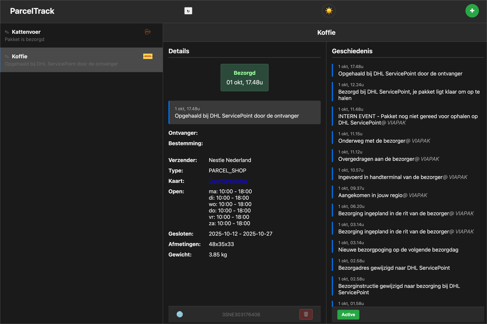

# ParcelTrack

A simple, self-hosted application to track parcels from PostNL, DHL, and other carriers via Ship24, with email notifications for status updates.



## ✨ Features

*   **Multi-Shipper Support**: Track packages from DHL, PostNL, and any carrier supported by Ship24.
*   **Modern Web UI**: A clean, responsive single-page application to view and manage your packages.
*   **Automated Status Updates**: A cron job periodically fetches the latest tracking status for all active packages.
*   **Email Notifications**: Receive an HTML email notification when a package's status changes.
*   **Automatic Archiving**: Delivered packages are automatically marked as `inactive`.
*   **Custom Naming**: Assign custom, friendly names to your packages for easy identification.
*   **Light & Dark Mode**: The UI respects your system's color scheme preference.

## 🚀 Getting Started

You can run ParcelTrack using Docker.

### Docker Setup (Recommended)

To get ParcelTrack up and running quickly using the pre-built Docker image, follow these steps. For local development or if you need to build the Docker image yourself, please refer to the [Local Development Setup](developer/CONTRIBUTING.md#local-development-setup) section in `developer/CONTRIBUTING.md`.

1.  **Download essential files:**
    Download `docker-compose.yml` and `.env.example` from the GitHub repository:
    *   [`docker-compose.yml`](https://github.com/CrazyHenk44/parcelTrack/blob/master/docker-compose.yml)
    *   [`.env.example`](https://github.com/CrazyHenk44/parcelTrack/blob/master/.env.example)
    Place these files in a new directory on your system.

2.  **Pull the latest pre-built Docker image:**
    ```bash
    docker pull ghcr.io/crazyhenk44/parceltrack:master
    ```

3.  **Create an environment file:**
    Rename `.env.example` to `.env` and customize it with your settings. To use Ship24, you must add your API key.

4.  **Run the containers:**
    ```bash
    docker-compose up -d
    ```

### ⚙️ Configuration

The application is configured via environment variables. Create a `.env` file in the project root or set these variables in your environment.

| Variable          | Description                                                              | Example                               |
|-------------------|--------------------------------------------------------------------------|---------------------------------------|
| `PARCELTRACK_URL` | The public URL of your ParcelTrack instance for links in emails.         | `http://parcels.example.com`          |
| `DEFAULT_EMAIL`   | The default email address to send notifications to.                      | `you@example.com`                     |
| `LOG_LEVEL`       | The minimum log level to output (`DEBUG`, `INFO`, `ERROR`).              | `INFO`                                |
| `SHIP24_API_KEY`  | (Optional) Your API key for Ship24. If provided, enables Ship24 tracking.| `apik_...`                            |
| `SMTP_HOST`       | Your SMTP server hostname.                                               | `smtp.mailgun.org`                    |
| `SMTP_PORT`       | Your SMTP server port.                                                   | `587`                                 |
| `SMTP_FROM`       | The "From" address for notification emails.                              | `noreply@example.com`                 |
| `SMTP_USER`       | (Optional) The username for SMTP authentication.                         | `postmaster@example.com`              |
| `SMTP_PASS`       | (Optional) The password for SMTP authentication.                         | `super-secret-password`               |

## 🔄 Usage

The web interface will be available at `http://localhost:8080` (or the port you configured in your `docker-compose.yml` file).

### Automated Tracking

The Docker setup includes a service that automatically checks for package updates every 5 minutes. If a status changes, it will send a notification to the configured email address. Delivered packages will be automatically moved to an inactive state.

## 📄 License

This project is open-source and licensed under the GNU General Public License v3.0.
